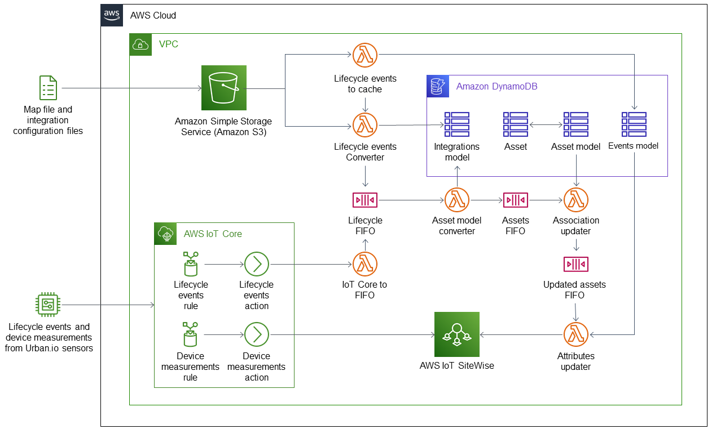

:xrefstyle: short

Deploying this Quick Start for a new integration between {partner-product-short-name} and AWS Sitewise builds the following environment in the AWS Cloud.

// Replace this example diagram with your own. Follow our wiki guidelines: https://w.amazon.com/bin/view/AWS_Quick_Starts/Process_for_PSAs/#HPrepareyourarchitecturediagram. Upload your source PowerPoint file to the GitHub {deployment name}/docs/images/ directory in this repo. 

[#architecture1]
.Quick Start architecture for {partner-product-short-name} for AWS IoT SiteWise

=== Resources
As shown in <<architecture1>>, the Quick Start sets up the following:

* Amazon S3 to store initial map and configuration files from an integrated Urban.io account.
* AWS IoT Core to do the following:
** Send lifecycle events from Urban.io (when a user creates or updates a device) to AWS Lambda to update AWS IoT SiteWise assets.
** Send device readings from Urban.io to AWS IoT SiteWise to display.
* AWS Lambda to do the following:
** Cache mappings and configurations from Amazon S3 to Amazon DynamoDB tables.
** Convert Urban.io lifecycle events from AWS IoT Core to AWS IoT SiteWise assets and send updated assets to AWS IoT SiteWise.
* Amazon Simple Queue Service (Amazon SQS) to queue lifecycle events for processing by AWS Lambda. 
* AWS IoT SiteWise to collect, manage, and visualize assets.

    