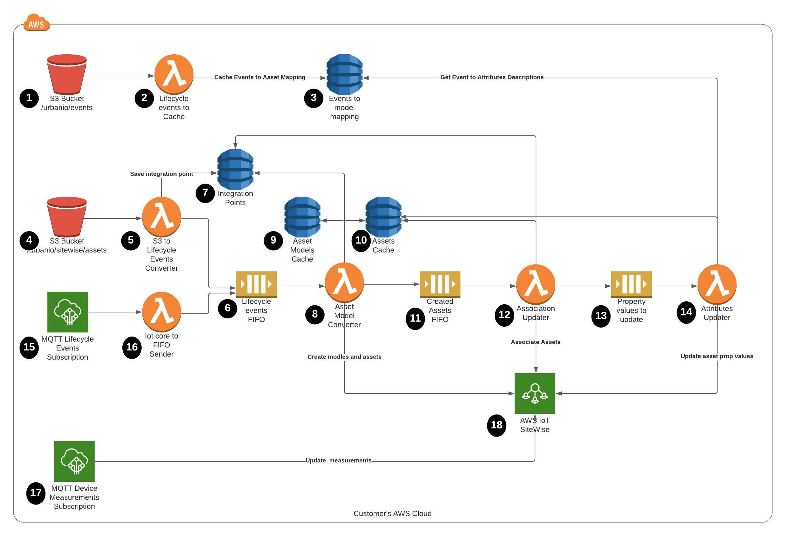
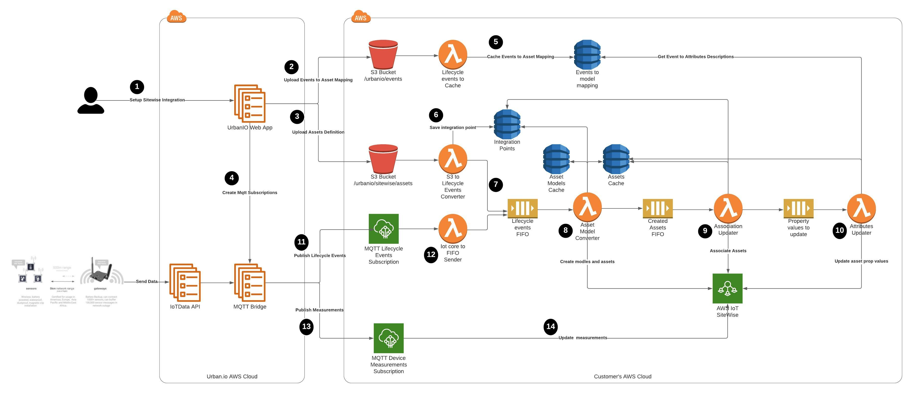

:xrefstyle: short

This Quick Start creates a serverless framework that uses Amazon S3, AWS IoT Core, SQS, Amazon DynamoDB, and Lambda to map the {partner-product-short-name} application's asset-modeling conventions onto AWS IoT SiteWise. Deploying this Quick Start for a new integration between {partner-product-short-name} and AWS Sitewise builds the following environment in the AWS Cloud.

// Replace this example diagram with your own. Follow our wiki guidelines: https://w.amazon.com/bin/view/AWS_Quick_Starts/Process_for_PSAs/#HPrepareyourarchitecturediagram. Upload your source PowerPoint file to the GitHub {deployment name}/docs/images/ directory in this repo. 

[#architecture1]
.Quick Start physical architecture for {partner-product-short-name} to Sitewise integration on AWS

=== Resources
As shown in <<architecture1>>, the Quick Start sets up the following AWS resources:

* **1. Events Amazon S3 object.** A JSON file mapping between lifecycle events and asset attributes will be uploaded on S3 bucket with the prefix /urbanio/events.
* **2. Lifecycle Events Mapping Updater.** An AWS lambda that is triggered by S3 file upload and caches the mapping between {partner-product-short-name} lifecycle events and IoT SiteWise asset attributes.
* **3. Events to Model Mapping Dynamo Table.** A Dynamo table that saves the mapping between Urban.IO event attributes and asste model attributes.
* **4. Assets Amazon S3 object.** The initial integration setup files - definition of the objects, a JSON file describing operators, customers, locations and devices in lifecycle events format will be uploaded to the specified S3 bucket with prefix /urbanio/sitewise/assets.
* **5. S3 to Lifecycle Events Converter.** An AWS lambda that reads initial object definitions from S3 and sends them to Lifecycle events FIFO.
* **6. Lifecycle Events FIFO.** AWS SQS on which are sent {partner-product-short-name} lifecycle events.
* **7. Integration Points Dynamo Table.** Dynamo table which saves the integration point from {partner-product-short-name} platform.
* **8. Asset Model Converter.** The AMC is an AWS lambda that converts {partner-product-short-name} lifecycle events into AWS Iot Sitewise assets. It is triggered by Lifecycle events FIFO and resends the already processed events on Created Assets FIFO.
* **9. Asset Models Cache Dynamo Table.** Dynamo table which caches created Sitewise models and their properties.
* **10. Assets Cache Dynamo Table.** Dynamo table which caches created Sitewise assets and their properties.
* **11. Created Assets FIFO.** SQS on which are send events for the creater Sitewise assets.
* **12. Association Updater.** The Association Updater is an AWS lambda that (re)associate the AWS IioT SiteWise assets based on the {partner-product-short-name} lifecycle events. It is triggered by Created Assets FIFO and resends the already processed events on Associated Assets FIFO.
* **13. Associated Assets FIFO.** SQS on which are send the asset property values to be updated.
* **14. Attributes Updater.** The Attributes updater is an AWS lambda that updates the attributes of AWS Iot Sitewise assets based on {partner-product-short-name} lifecycle events. It is triggered bu the Associated Assets FIFO.
* **15. AWS IoT Core Rule.** This rule receives {partner-product-short-name} lifecicle events which will be converted into AWS IoT SiteWise assets.
* **16. IoT Core to FIFO Sender.** An AWS Lambda triggered by AWS IoT Core rule, that sensds the recieved lifecycle MQTT event to the Lifecycle events FIFO.
* **17.AWS IoT Core Rule.** This rule receives telemetry data that is immediately ingested into AWS IoT SiteWise.
* **18. AWS IoT SiteWise.** With this managed service, you can collect, model, analyze, and visualize data from industrial equipment at scale. The service, which maintains the asset hierarchy's metadata, contains a managed database for all the time-series data generated by the customer assets. It includes a SaaS dashboard-building feature called AWS IoT SiteWise Monitor. You use SiteWise Monitor to build custom dashboards, or portals, to view and share near-real-time data from your connected devices and equipment.

=== Workflow
The first step of integrating {partner-product-short-name} portal and AWS IoT Sitewise is to deploy the CloudFormation template in your account. +
{empty} +
As a second step after launching the Quick Start you should setup an integration in app.urban.io following https://support.urban.io/support/solutions/articles/43000627793-integration-with-aws-iot-sitewise/preview[these steps] and the framework automatically will import the selected data from the {partner-product-short-name} application's asset-hierarchy into AWS IoT SiteWise models and assets. +
{empty} +

[#architecture2]
.Quick Start workflow for {partner-product-name}

The syncronization between the content of your {partner-product-short-name} account and AWS IoT Sitewise will be made automatically.
The workflow can be traced on <<architecture2>>, but keep in mind user input will be needed only for Step 1.:

* **1. Setting up Sitewise Integration.** The user sets up the integration in {partner-product-short-name} portal following https://support.urban.io/support/solutions/articles/43000627793-integration-with-aws-iot-sitewise/preview[this guide].
* **2. Upload Events to Assets Mapping.** Then {partner-product-short-name} portal will first upload a file describing the mapping between {partner-product-short-name} events and AWS IoT Sitewise asset properties to the specified S3 bucket.
* **3. Upload Assets Definition.** After that {partner-product-short-name} portal will upload asset hierarchy definition in the specified S3 bucket.
* **4. Create MQTT Subscriptions.** As a next step {partner-product-short-name} portal automatically will create MQTT subscriptions for the selected entity.
* **5. Cache Events to Assets Mapping.** The uploaded Events to Assets Mappings are cached in a dynamo table for easier access.
* **6. Save Integration Point.** As a first step of processing the initial asset definitions file from the S3, the integaration point is stored.
* **7. Send S3 Lifecycle Events to FIFO.** The next step of processing the initial assets definitions from S3 is to send them to Lifecycle events FIFO.
* **8. Asset Model Converter.** Assets models and assets are being created/updated based on the events in the **Lifecycle events FIFO**.
* **9. Association Updater.** Associates assets based on the events in **Created assets FIFO**.
* **10. Attributes Updater.** Update assets properties values based on the events in **Associated assets FIFO**.
* **11. Publish Urban.io Lifecycle Events.** When a user creates/updates an enitity in {partner-product-short-name} portal, a lifecycle event is triggered to notify for the change. The MQTT bridge publishes the event to the client's IoT Core.
* **12. Send MQTT Lifecycle Events to FIFO.** The recieved MQTT lifecycle event is send to the **Lifecycle events FIFO**.
* **13. Publish Measurements.** When the devices send measurement data the MQTT bridge is publishing it to the client's IoT Core.
* **14. Update Measurements.** An IoT core rule is automatically sending the measuremts data to IoT Sitewise.
