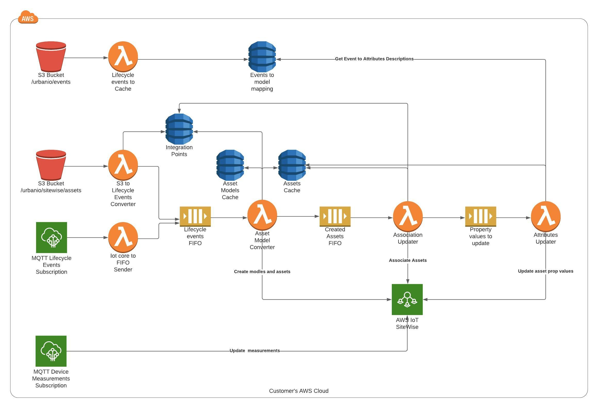

:xrefstyle: short

This Quick Start creates a serverless framework that uses Amazon S3, AWS IoT Core, SQS, Amazon DynamoDB, and Lambda to map the {partner-product-short-name} application's asset-modeling conventions onto AWS IoT SiteWise. Deploying this Quick Start for a new integration between {partner-product-short-name} and AWS Sitewise builds the following environment in the AWS Cloud.

// Replace this example diagram with your own. Follow our wiki guidelines: https://w.amazon.com/bin/view/AWS_Quick_Starts/Process_for_PSAs/#HPrepareyourarchitecturediagram. Upload your source PowerPoint file to the GitHub {deployment name}/docs/images/ directory in this repo. 

[#architecture1]
.Quick Start architecture for {partner-product-short-name} to Sitewise integration on AWS

As shown in <<architecture1>>, the Quick Start sets up the following:

* **Amazon S3.** The S3 bucket receives the initial integration setup files - definition of the objects (a JSON file describing operators, customers, locations and devices in lifecycle events format) and a mapping between lifecycle events and asset attributes.
* **AWS IoT Core.** This service receives telemetry data that is immediately ingested into AWS IoT SiteWise and {partner-product-short-name} lifecicle events which will be converted into AWS IoT SiteWise assets.
* **AWS IoT SiteWise.** With this managed service, you can collect, model, analyze, and visualize data from industrial equipment at scale. The service, which maintains the asset hierarchy's metadata, contains a managed database for all the time-series data generated by the customer assets. It includes a SaaS dashboard-building feature called AWS IoT SiteWise Monitor. You use SiteWise Monitor to build custom dashboards, or portals, to view and share near-real-time data from your connected devices and equipment.
* **S3 to Lifecycle Events Converter.** An AWS lambda that reads initial object definitions from S3 and sends them to Lifecycle events FIFO.
* **IoT Core to FIFO Sender.** An AWS Lambda triggered by AWS IoT Core rule, that sensds the recieved lifecycle MQTT event to the Lifecycle events FIFO.
* **Asset Model Converter.** The AMC is an AWS lambda that converts {partner-product-short-name} lifecycle events into AWS Iot Sitewise assets. It is triggered by Lifecycle events FIFO and resends the already processed events on Created Assets FIFO.
* **Association Updater.** The Association Updater is an AWS lambda that (re)associate the AWS IioT SiteWise assets based on the {partner-product-short-name} lifecycle events. It is triggered by Created Assets FIFO and resends the already processed events on Associated Assets FIFO.
* **Attributes Updater.** The Attributes updater is an AWS lambda that updates the attributes of AWS Iot Sitewise assets based on {partner-product-short-name} lifecycle events. It is triggered bu the Associated Assets FIFO.

As a second step after launching the Quick Start you should setup an integration in app.urban.io following steps (TODO put link) and the framework automatically will import the selected data from the {partner-product-short-name} application's asset-hierarchy into AWS IoT SiteWise models and assets.
