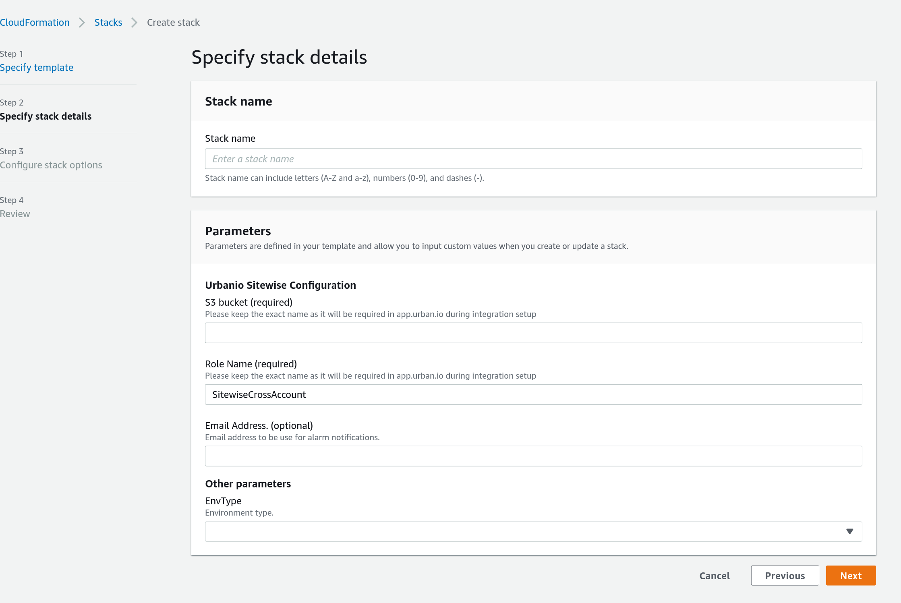

// Edit this placeholder text to accurately describe your architecture.

This Quick Start provides a CloudFormation template, which lets you configure:

* *StackName* (required). The name of the stack.
* *S3 bucket* (required). The name of the bucket in which {partner-product-short-name} will upload the initial integration setup.
* *Role name* (required). The name of the IAM role that will grant {partner-product-short-name} permissions to upload data to S3 and send messages to AWS IoT Core topics.
* *Email address* (optional). Email address on which you want to recieve error notifications. 

[#deployment_options]
.Deploynemt options in the Quick Start for {partner-product-short-name} to Sitewise integration on AWS
